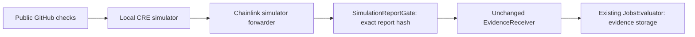

# Public CI evidence through the CRE simulator

The hackathon can show real GitHub checks recorded on Monad testnet through Chainlink's local simulator; Kris needs no paid CRE access, and the result is not a hosted oracle-network deployment.

## What runs

`workflows/ci-evidence/main.ts` is a TypeScript Chainlink Runtime Environment (CRE) workflow. An HTTP trigger supplies an **exact 40-character commit SHA**, public GitHub repository URL, job id, policy and submission hashes, required check names, and expiry. Pull-request-number resolution is outside this slice.

The workflow uses CRE's HTTP capability to request the public GitHub REST check-runs endpoint **without a token**. Each node normalizes the relevant checks, preserving duplicate runs and API order, and uses `consensusIdenticalAggregation` over the normalized JSON string. It hashes the same nine-field `EvidenceAttestation` as the board attester and uses `runtime.report()` and `EVMClient.writeReport()` to deliver its ABI-encoded report.

The simulator exercises that API and WebAssembly execution locally. It does **not** demonstrate agreement between independent oracle nodes, independently rerun GitHub CI, authenticate the CI workflow's provenance, or authorize payment. The public board attester and this workflow read the same GitHub source. Required check names and the submission/policy binding are explicit operator inputs; the recorded `app` is not a full producer/workflow provenance check.

## Safe simulation receiver

Chainlink's simulator forwarder does not authenticate workflow identity. Registering an unrestricted receiver behind it would allow other callers to write arbitrary evidence while that receiver was trusted. This demo therefore uses:



`SimulationReportGate` only deploys on chain **10143** and admits one immutable report hash from the configured simulator forwarder. It constructs the repository's unchanged `EvidenceReceiver`, which trusts only that gate. The receiver's owner is the gate, which exposes no permission-changing method. The gate moves no tokens and adds no payment path. Even a stranger using the public forwarder can submit only the approved statement. The evaluator's digest replay protection prevents a second endorsement of that statement.

The wrapper temporarily registers **the actual EvidenceReceiver**, then unregisters it in `finally`, including on failed runs. `pnpm cre:cleanup` is the recovery command after a killed process. The gate protects against arbitrary reports even if cleanup is interrupted. The receiver remains deployed and its historical record remains readable after revocation.

Addresses and RPC come from the `cre.simulation` subsection of `contracts/config/monad-testnet.json`. The production `cre.forwarder` is deliberately untouched. The simulator address was confirmed with CRE CLI 1.35.0's `cre workflow supported-chains --output json` (`mockAddress`, not `address`).

## Fixture and parity

The demonstration reuses **completed job 8 on legacy demo-v1**, whose actual evaluator and holding are retained in the network config. It does not use the current demo stack. It creates, funds and settles no jobs.

- Repository: `https://github.com/grmkris/runner-spike-fixture`
- Commit: `c850f7a58015bafe065257f263a2ecc01da56dfe`
- Required check: `test`; two successful check runs, including the duplicate name.
- Board evidence transaction: `0xdd25f81be0b4f36169fa26aed7381d1cbf11bd41ab85f1d7b692a8fc741d4b3d`.
- Core submission/award transaction: `0x98566e40bfdd10b477dabdeda258b308e16f26c24e4c8b5e45f8ca0ee01d42c3` (block 66177447).
- Exact EIP-712 digest: `0xbee95e08ac012e11a3e1093725daf5b9ce0f782b5a9500779a1f51650f897507`.

The test vector was decoded from that real board transaction and independently matched to evaluator storage. Tests require byte-for-byte attestation equality, the board's canonical JSON, ABI round-trip, and the same EIP-712 digest. The domain is `AgentJobsEvaluator`, version `1`, chain 10143, with the **legacy evaluator** as verifying contract. The repository hash covers the full submitted URL; both SHA words are left-padded to bytes32.

Like the board, any unfinished relevant check or no relevant checks prevents a report. Missing required checks, skipped/null/failed conclusions produce failure (`2`); only all-success without missing checks produces success (`1`). Unlike the board's current one-page fetch, this workflow refuses responses with more than 100 checks or a count that does not match the returned array. It also refuses an unexpected returned SHA. This prevents attesting an incomplete successful subset.

## Run it

Prerequisites: the repository's pnpm toolchain, Foundry, Bun (the CRE SDK's compiler runtime), CRE CLI >=1.30 with login, and testnet gas in the configured admin account. This run uses CLI **1.35.0**, SDK **1.22.0** and Javy plugin **1.7.0**. Dependencies are installed with pnpm only.

```sh
pnpm install --frozen-lockfile
# Each expensive step uses the shared machine's heavy wrapper.
heavy pnpm check
heavy sh -c 'cd contracts && forge build src/SimulationReportGate.sol'
# DEPLOYER_PRIVATE_KEY is read only from this worktree's ignored .env.local (0600).
# Setup sends one testnet deployment; no CRE workflow is registered or deployed.
heavy pnpm cre:setup
heavy pnpm cre:simulate
heavy pnpm cre:simulate --broadcast
pnpm cre:cleanup
```

`heavy` exit 75 means its slots are busy; wait and retry that command. Do not pipe it and accidentally hide its exit status.

The standalone repository TypeScript 7 check runs before every simulation. CRE's compiler also uses the TypeScript JavaScript API, which TS7 does not expose. A scoped pnpm `packageExtensions` entry therefore gives only the CRE SDK its own pinned TypeScript 5.9.3 compiler dependency. All workspace gates keep TS7; the SDK's typecheck and runtime checks remain enabled.

The wrapper accepts only optional `--broadcast`; its project has only `monad-testnet`, and both the config and live RPC chain id must equal 10143. The signer is parsed by name from `.env.local`, checked against the testnet admin, and passed to CRE via `CRE_ETH_PRIVATE_KEY` in the child environment. Keys are never command arguments or evidence files. No GitHub secret is used.

**Historical fixture expiry:** the approved report deliberately preserves the board's original `validUntil=1791132076` (4 October 2026, 16:41:16 UTC), making the two verifier digests identical. After that time, the workflow refuses it. For a new demonstration, explicitly prepare a fresh payload, inspect its new digest, and deploy a new immutable gate; do not silently extend the old attestation or relax the existing gate. A changed live check list also requires a newly approved report. The committed artifacts remain valid historical evidence.

Local operation records and logs live under ignored `workflows/ci-evidence/.local/`. Deployment/admin operations record sender, nonce, calldata hash and transaction hash before submission and reconcile the receipt on rerun. Broadcast attempts are recorded before CRE starts and cannot be retried blindly. If interrupted, inspect the journal, reconcile its transaction/nonce and receiver events, then run cleanup. No automatic payment retry exists.

The simulator is a manual integration script, **not** a cached task or automatic CI broadcast. `pnpm check` includes the pure digest tests and Solidity gate tests. The opt-in `CRESimulationForkTest` uses real legacy evaluator bytecode on a local testnet fork and demonstrates completed-job eligibility; it sends no transaction.

## Evidence and limits

The dated proof and raw receipts are in [`evidence/cre-simulation/`](evidence/cre-simulation/). A successful CLI exit or forwarder receipt alone is insufficient: the broadcast wrapper requires both `ReportReceived` and `EvidenceAttached`, then reads and compares the stored digest, submission hash, policy hash, tested SHA, expiry and conclusion. It also records verifier revocation. Full report bytes retain the fields not stored separately by the evaluator.

A real hosted CRE deployment would require Chainlink access and its paid plan, HTTP-trigger authorization, the production forwarder, and a newly configured receiver pinning workflow identity. It would remove the one-report simulation gate and require a fresh review of report authorization, source provenance and input bindings. None of that deployment, registration, payment, or mainnet activity is part of this proof. The older spec's “S5 live deployed workflow” criterion is still unfulfilled; Kris's 29 September instruction selects simulation as the hackathon path.
