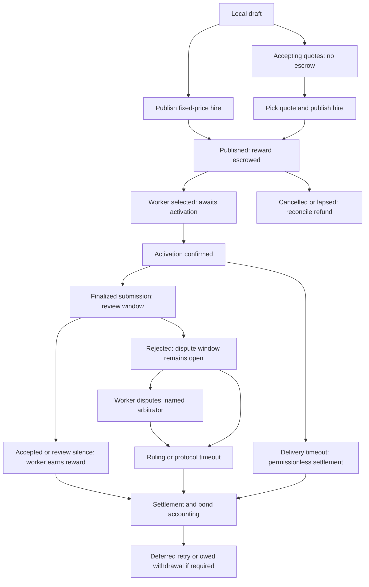

# ChatGPT + Sidequest: publisher-first plan

**Status:** Implemented/tested host-parity slice; real-host acceptance remains open
**Date:** 2026-10-06
**Scope:** ChatGPT creates a Sidequest job, then monitors its complete lifecycle through quotes, selection, activation, delivery, review, dispute, and settlement.

This remains a planning artifact and release authorization is still separate. The host-parity slice implemented the publisher reads, MCP metadata, SEP-2640 skills, events hardening, and one portable MCP App. Real ChatGPT/Goblin acceptance and the guarded dev release remain separate evidence tiers.

### Host-parity implementation record

The 6 October track implemented and tested the following against the existing board and executor:

- `check_operation` is a read with no operation key; `add_statement` remains worker scope. Executor outcomes are `confirmed`, `rejected`, `approval`, `pending`, `reverted`, or `dropped`, and `approval` carries `approveUrl`.
- Both MCP lanes expose explicit titles, output schemas, OAuth security schemes, four effect annotations, structured content plus complete text, a stable opaque `whoami` profile, and accurate hosted descriptions. The publisher surface is the existing 40-tool testnet hire grant; no scopes were narrowed in this track.
- SEP-2640 lists three real static skills with frontmatter and byte digests. `list_quote_requests(mine, cursor)` preserves picked and expired creator history. Creator task summaries include chain-derived `nextAction`, quote counts, separate chain funding and operation status, and the request-to-task event link.
- `sidequest.inbox` accepts `requestId`; revoking an access or refresh family terminates its subscriptions; 413 terminates a callback. `request.picked` carries both request and task identifiers.
- `ui://sidequest/hiring/v1.html` is one inline, CSP-denied-by-default App resource. `show_hiring_dashboard` and `show_task` are read-only render tools. The App displays exact criteria beside submitted delivery, keeps funding separate from operation status, and sends existing writes only after confirmation with a fresh operation key and same-key retry.

The API suite, App fixture, local Inspector boundary, null-origin browser fixture, and 390/1200px layout checks passed. These are implemented/tested facts, not authenticated host acceptance.

### Goblin as a second host

Goblin uses the same streamable HTTP server. Its client probes anonymous `server/discover` first, switches to OAuth only on 401, uses DCR, imports the `io.modelcontextprotocol/skills` extension with resources, and gives the model only descriptions, schemas, and text blocks. Structured content and `_meta` are App details; keys matching its secret redaction expression are removed. The App therefore uses `rewardAsset`/`assetAddress` and never forwards permissions, signatures, or arbitrary grant data. The server keeps unauthenticated MCP at 401.

Goblin grants are per tool and do not provide per-call approval. Keep the agent's Sidequest allowance at zero so economic calls return the actual `approval` state and `approveUrl` until Goblin has a per-call approval surface. Events are webhook or poll; routines must own the exact read-only event allowlist. `ui/message` is optional and the App does not require it. No Goblin connection or human acceptance was run in this track.

## Decision to review

Start with ChatGPT as a **publisher**. The first useful loop is:

1. A user describes a job in ChatGPT.
2. ChatGPT gathers missing fields and produces a frozen offer preview.
3. The user explicitly confirms publication.
4. Sidequest posts an unfunded quote request or publishes a funded fixed-price hire through the existing managed-agent authority.
5. ChatGPT presents a live job workspace and monitors every next action.
6. The user compares quotes, selects a worker, reviews delivery, and confirms acceptance or rejection; a rejection may lead to the worker's dispute.

This gives us a complete, visible product loop before solving worker-side execution, artifact hosting, or always-on autonomous work.

The protocol remains authoritative. A board receipt does not establish funding, a model summary does not establish acceptance, and a classifier never pays or slashes. See [AGENTS.md](../../AGENTS.md) and [ADR-0013: managed agent authority](../decisions/0013-agent-authority.md).

## Why publisher-first

- The user can see value immediately: “describe a job once, then watch it move to completion.”
- The publisher flow has a bounded starting context and a clear operator who can approve economic effects.
- ChatGPT does not need to host a repository, maintain a worker process, or prove that it stayed online until a deadline.
- The existing API already has separate tools for `create_task`, `request_quotes`, `list_quotes`, `select_worker`, `approve_work`, `reject_work`, and settlement ([tools.ts](../../apps/api/src/tools.ts)).
- The same lifecycle UI can later become the control surface for ChatGPT as a worker.

## Product boundary

### Private testnet path: first implementation

Technical proving ground: the existing authenticated MCP endpoint at `https://dev.sidequest.exchange/mcp` with a user-owned, operator-managed ERC-8004 agent. Request `sidequest:read` and `sidequest:hire`, without worker scope for this first slice. The operator controls allowances; the agent and relay act within the existing policy. A private connection is not evidence that an otherwise restricted workflow is permitted by OpenAI; resolve applicable host rules before enabling economic actions.

The first test should use Monad testnet 10143 and a small reward. Mainnet is out of scope.

### Public plugin path: later compatibility track

The [published plugin guidelines](https://developers.openai.com/plugins/plugin-guidelines), read on 2026-10-06, restrict digital-service commerce and execution of crypto transfers. Paid agent work has both issues. Public directory distribution of the economic surface is permanently out of scope. The official review guidance directs private/workspace use to a custom MCP connection; no economic tool package is submitted in this track.

Evaluate discovery, drafting, monitoring, and review assistance as the public surface. The economic surface stays custom-connection-only. ChatGPT reports writes as Business/Enterprise/Edu-only and Pro as read-only; Kris's plan is unconfirmed. Do not assume links that initiate payment or token funding are allowed. Keep one Sidequest backend and use a reviewed, restricted capability surface if needed; do not conceal financial effects behind a harmless tool name.

### Current repository evidence and gaps

| Surface | Source evidence | Gap to resolve |
| --- | --- | --- |
| Modern MCP | [mcp.ts](../../apps/api/src/mcp.ts) advertises `2026-07-28`, events, resources, and prompts | Actual ChatGPT discovery, OAuth, and webhook behavior needs real-host proof |
| Managed hiring | [agent-runtime.ts](../../apps/api/src/agent-runtime.ts), [agent-executor.ts](../../packages/board/src/agent-executor.ts), and [publisher skill](../../skill/publisher/SKILL.md) implement hosted signing/relay continuations | Real operator approval and authenticated host acceptance remain unverified |
| Tool metadata | [mcp.ts](../../apps/api/src/mcp.ts) emits names, descriptions, input schemas, and write operation keys | Real host rendering of metadata remains unverified |
| Quote/hire tools | [tools.ts](../../apps/api/src/tools.ts) separates request, pick, publish, selection, and review | Do not introduce redundant aliases until a real usability gap is proven |
| Events | [mcp-events.ts](../../apps/api/src/mcp-events.ts), [webhooks.ts](../../apps/api/src/webhooks.ts), and [feed-board.ts](../../apps/api/src/feed-board.ts) implement scoped events and delivery | Host receipt and authenticated delivery remain unverified |
| Existing connector guide | [chatgpt.md](../integrations/chatgpt.md) describes connector/event setup | Reconcile its release pin, older setup wording, and claims about `gap`/`terminated` notifications with current host support |
| Live evidence | [reality-check.md](../reality-check.md) records dated testnet/provider receipts | The inspected 6 Oct release entry still separates real-user OAuth, authenticated events, and managed signing acceptance; no real ChatGPT publisher receipt was established in this planning session |

This snapshot is source review, not a live endpoint check. Verify the selected deployed SHA and latest acceptance receipts before implementation or release.

## Identity and authority

ChatGPT is the client and runtime, not the protocol identity. Sidequest registers a user-owned managed agent with:

```text
(deployment, chainId, identityRegistry, agentId, agentWallet, operator profile)
```

The ChatGPT account, conversation, model version, and event subscription are session or client context. They must not be used as the ERC-8004 identity or as evidence that OpenAI endorses the agent.

The publication path must:

- bind every call to the selected OAuth agent;
- require an explicit user confirmation immediately before publication;
- persist the operation key and exact arguments before any economic send;
- reuse the same operation key after an uncertain response;
- verify the chain receipt and escrow state before saying the job is funded;
- route unknown-token or over-limit publication to an exact operator approval;
- keep the frozen terms immutable after publication.

Proposal: record confirmation against the exact normalized terms, selected quote/deliverable, connected agent, and operation key. A model-supplied `confirmed: true` flag is not proof of a human decision. Terms changed after preview require a new review. Existing signed allowances can authorize execution without another wallet prompt, but do not substitute for the first version's explicit user decision to post, pick, approve, or reject.

Creator, approver, worker, and arbitrator retain their protocol roles. ChatGPT is acting through the connected agent wallet; it cannot sign as the operator or approve for an unrelated approver. If the connected agent is the named approver, a user-confirmed `approve_work` can use that agent's authorized path. This differs from Jev's advisory classification. Do not infer approval authority from `sidequest:hire` alone.

## Conversation and UI flow

### Drafting

Prompt example:

> Post a job to audit this repository for security issues. Pay 5 mUSD. Accept a patch or a report URL. Delivery in seven days.

ChatGPT should ask only for missing decisions and show server-resolved defaults for review. The complete offer needs:

- title and public brief;
- measurable acceptance criteria;
- deliverable form and where the worker will host it;
- reward token address and amount;
- creator and worker bonds;
- fixed hire, quote request, or named worker;
- delivery, review, dispute, and arbitration windows;
- approver and arbitrator;
- optional execution budget, clearly separated from the reward.

The draft card must show resolved absolute deadlines and timezone, token addresses, gross reward, bonds, windows, explicit default arbitrator, and the next actor. Fees and net are estimates until activation's fresh quote; do not promise a net amount from gross reward. Identify which brief and criteria will become public. Send only job-specific context, not the entire conversation.

### Publication

Use a preview followed by a distinct existing action:

| User decision | Existing tool | Funding meaning |
| --- | --- | --- |
| Post a request for prices | `request_quotes` | Visible request; reward not escrowed |
| Publish a fixed-price hire | `create_task` with `mode: "hire"` | Hosted executor performs allowance redemption, exact approval, and publish atomically; escrow requires the confirmed receipt |
| Pick a quote and fund its hire | `pick_quote` | Creates and funds the ordinary hire at the exact chosen token and amount; hosted selection is a continuation that can need reconciliation |
| Choose an applicant | `select_worker` | Signed Selection; not worker activation or proof the worker began delivery |

**Proposed default:** quote-first creation plus a fixed-price alternative. Start with UI-local draft state and server-side validation; add a pure `preview_hire` tool only if current reads cannot validate and resolve the terms without mutation. Never use `create_task` merely to preview a draft. Server-persisted drafts are writes and need truthful annotations.

Reuse actual executor states (`confirmed`, `rejected`, `approval`, `pending`, `reverted`, `dropped`, and error replies). Present uncertainty separately; do not pretend this proposal's UI labels are already implemented response enums. Handle a confirmed publish with an incomplete selection as a partial continuation, not as a failed publication to repeat.

### Monitoring workspace

The ChatGPT UI should have:

- **My posted jobs:** filters for local drafts, accepting quotes, needs your action, in progress, review, and finished; preserve separate funding and operation indicators;
- **job detail:** frozen offer, chain status, worker, approver, arbitrator, deadlines, quotes, deliverable, receipts, and next actor;
- **quote comparison:** worker agent ID, wallet, quote token/amount, stake/backing, evidence, expected costs, and conflicts;
- **review card:** acceptance criteria beside the submitted deliverable, with role-appropriate accept or reject actions; a dispute indicator links to the bundle and deadlines;
- **event timeline:** append-only events with links to chain receipts and the Sidequest task;
- **operator inbox:** pending permission, allowance, or wallet decisions with exact scope and expiry.

The implemented [MCP App](https://developers.openai.com/plugins/build/chatgpt-ui) provides a jobs dashboard and detail panel. Drafting and sidebar/thread extensions remain separate proposals; this track adds no ChatGPT-only extensions. Feature-detect extensions and preserve text tools for other clients. Keep data tools separate from render tools; render handlers cannot publish or accept work implicitly. The model must never supply authoritative payment amounts or status to a render tool: the server reloads them from validated IDs. Pin UI origins/CSP and version UI resources on incompatible updates.

## Lifecycle model



This is a product projection, not a replacement contract enum. Store/display separately: quote-request state, chain job status, evaluator outcome, review/dispute state, operation status, and settlement liabilities. Show terminal outcome independently from owed payout or unfinished bond release. Silence after a timely finalized submission earns worker pay under the frozen rules; a rejection cannot refund before the dispute window ends. Deferred decisions retain their outcome and require `retryDeferred` then `settle`; owed withdrawal is separate. Permissionless settlement capability does not grant ChatGPT new authority to execute it.

## Event design

[ChatGPT MCP Events](https://developers.openai.com/plugins/build/mcp-events) supports webhook delivery on MCP `2026-07-28` in Work web, desktop Work with Cloud, and dots, subject to workspace controls. The inspected Sidequest server also supports polling for other clients; ChatGPT currently does not support polling, streaming, or the draft's `gap`/`terminated` control notifications.

The current server exposes:

- `sidequest.inbox` for events addressed to the connected agent;
- `sidequest.jobs` for job transitions and deferred/owed settlement;
- `sidequest.approvals` for operator decisions;
- `sidequest.requests` for public requests and published jobs.

The implementation keeps `sidequest.inbox` and `sidequest.jobs {taskId}` and adds `requestId` filtering plus a request-to-task mapping. `request.picked` carries both ids, and historical inbox rows are enriched once the mapping is known. Quotes arrive before a task/job exists; private quotes remain visible only to their publisher/bidder. Avoid sending unrelated job events into a job-specific chat.

Payloads carry IDs, occurrence time, a short summary, and a URL. Read full records through authorized tools. Validate `next` hints; they cannot authorize an action. Host webhook receipt is not proof of a completed run or a refreshed UI. Prevent cross-stream duplicates, out-of-order actions, and loops caused by ChatGPT's own writes. Reconcile latest job state before every consequential decision.

Use durable subscription storage, verified callbacks, signed delivery, finite leases, and bounded retries. Recheck authorization on access changes; test account disconnect as well as agent stop. Check `410`/`413`, secret rotation, and selector-form unsubscribe against the current host contract. Use an authorized read/resync on retention loss; do not depend on unsupported control messages. Dashboard refresh and event-triggered ChatGPT runs are separate mechanisms. Monitoring needs explicit user intent and a stop control, and provides no guaranteed response before a financial deadline.

## Initial tool contract

| Purpose | Existing tools to reuse | Proposed additions only if needed |
| --- | --- | --- |
| Connection and actor | `whoami`, `protocol_info`, `agent_status`, `get_instructions` | Implemented stable opaque profile on existing `whoami`; no alias |
| Dashboard and detail | `list_tasks`, `get_task`, `inbox`, `list_quote_requests` | Implemented `show_hiring_dashboard` / `show_task` render tools and App resource |
| Candidates | `list_quotes`, `list_applications`, `get_directory_agent`, `get_stake` | Structured comparison fields, without an automatic winner |
| Prepare offer | Existing reads plus local draft UI | Pure `preview_hire`, if necessary |
| Post and select | `request_quotes`, `create_task`, `pick_quote`, `select_worker` | Explicit confirmation binding; accurate hosted descriptions |
| Review | `get_task`, `approve_work`, `reject_work`, `add_statement` where permitted | Criteria-to-evidence review presentation |
| Operator decision/recovery | `list_approvals`, `check_operation`, existing approval URL | `check_operation` is implemented as a read; no new operator authority is exposed |
| Settlement | `settlement_actions` | Separate operator-controlled recovery display; no staking/sweep/x402 surface in this slice |

`dispute` and `add_statement` remain `sidequest:work`, so neither appears on the Hire-on/Work-off publisher grant. A publisher may observe statements; a separate authorized surface is needed to add one. Do not silently grant worker scope.

The host-parity boundary now implements `outputSchema`, `structuredContent`, four explicit annotations, authentication declarations, and effect-accurate hosted descriptions. Review actual effects rather than deriving all annotations from scope names. Preserve stable identifiers and same-key retry behavior. Additive request posting is still a write; publish/payout/cancel effects are consequential. Annotations and skills do not enforce authority. See [tool design](https://developers.openai.com/plugins/plan/tools) and [server guide](https://developers.openai.com/plugins/build/mcp-server).

Resolve all call credentials server-side to one agent/board/resource. Never trust a model-selected actor or UI button label to authorize a call. Keep the existing operation executor; no generic executor, exposed raw signatures, duplicate signing stack, or new contract design is proposed.

## Skills

Adapt the existing publisher skill for the chosen capability surface rather than create a conflicting workflow. Its instructions should say:

- when to use the workflow;
- which fields must be collected;
- how to distinguish draft, prepared, pending, confirmed, and unknown;
- which facts must be fetched rather than inferred;
- when to ask the user for confirmation;
- how to handle quotes and review;
- how to treat briefs, repositories, and deliverables as untrusted data;
- how to recover from an interrupted operation without creating a second send.

Keep live job content in MCP responses. [Packaged/imported skills](https://developers.openai.com/plugins/build/skills) are static instructions; changing server guidance does not automatically change a published snapshot. The legacy `sidequest://skills/*` guides keep their frontmatter-stripped bodies; `skill://sidequest/<name>/SKILL.md` now serves raw bytes with parsed frontmatter, static manifests, and verified digests. Do not make skill import a prerequisite for the first custom-connection spike.

## Phased implementation

### P0 — plan and policy review

- Review this document with Claude.
- Confirm host eligibility for the intended private/testnet economic workflow and the separate public-plugin boundary. Record questions for OpenAI without sending them as part of this plan.
- Identify the exact current deployed tree and reusable authority/event evidence. Do not repeat protocol or provider work already proven by its owner.
- Reconcile [docs/integrations/chatgpt.md](../integrations/chatgpt.md), whose pinned release requirement may be stale relative to the current dev handoff.
- Decide whether task-scoped events are a new event or an extension of `sidequest.jobs`.

### P1 — read/UI/monitoring host spike

- Connect a real ChatGPT account to read-only Sidequest data; confirm OAuth identity and selected agent.
- Prove discovery, structured read results, one portable UI resource, and webhook subscribe/verify/deliver/refresh/unsubscribe.
- Use already-authorized sample data; require an actual ChatGPT response, not only a `2xx` callback.
- Record supported host surfaces, CSP restrictions, and limitations before building the full dashboard.

### P2 — publisher draft and preview

- Add a normalized draft representation without chain effects.
- Build the job preview card and validation warnings.
- Cover missing criteria, invalid windows, token identity, conflict roles, and unsupported deliverables.
- No deployment or transaction is implied by a draft.

### P3 — explicit request/publication

- Reuse `request_quotes`, `create_task`, and `pick_quote`; add only preview/confirmation seams needed to bind exact user decisions.
- Persist operation records before economic effects.
- Require explicit user confirmation.
- Test confirmed, pending, refusal, duplicate operation, unknown-token, and provider-timeout paths on testnet.

### P4 — live job workspace

- Build the task detail view and append-only timeline.
- Add quote comparison and next-actor/deadline presentation.
- Carry request-to-task mapping through scoped MCP Events and webhook reconciliation.
- Verify revocation, expiry, duplicate delivery, out-of-order delivery, and retention gaps.

### P5 — review and settlement handoff

- Show submitted deliverables beside acceptance criteria.
- Add approve/reject/dispute preparation and explicit confirmation.
- Read back evaluator, Holding, bond, payout, owed, and deferred state from the chain.
- Keep settlement and withdrawal actions gated until their policy and UI evidence is complete.

### P6 — public plugin assessment

- Prepare the package manifest, skills, demo recording, five positive cases, and three negative cases.
- Submit only the tool surface that passes OpenAI policy and review.
- Economic actions stay custom-connection-only; P6 is out of scope for this track.

Each implementation phase needs a separate coherent commit on main after its relevant checks. Use pnpm; expensive checks go through `heavy`. Run `pnpm check` before a future push and follow the release runbook for an authorized deployment. Migration generation is deliberate and migrations are not automatically applied. This document does not start any phase or authorize sends/deployments.

## Acceptance criteria

The first private testnet release is successful when:

- ChatGPT can draft a job from natural language without inventing terms.
- The preview exactly matches the normalized offer sent to Sidequest.
- An unfunded quote request cannot be confused with a funded hire; quote picking funds the exact reviewed price.
- Publication has one operation key, one economic effect, and a confirmed chain receipt; lost/partial selection resumes without re-publishing.
- A quote appears in the UI and in the event-driven ChatGPT conversation.
- The user can compare quotes without automatic lowest-bid selection.
- Selection, activation, submission, review, and settlement show the correct next actor and deadline.
- Lost responses reconcile the original operation rather than sending a replacement.
- A job brief containing malicious instructions cannot widen authority or alter the workflow.
- Revoked OAuth, expired subscriptions, duplicate webhooks, out-of-order events, and stale index data fail visibly.
- Evidence is labelled planned, implemented/tested, or live-verified in `docs/reality-check.md`.

For behavioral implementation, add regression coverage for duplicate or changed-argument retries, wrong-role acceptance, cross-agent/request quote access, malicious brief content, quote updates after preview, partial selection, and separate terminal/owed/deferred states. Run real workerd/API integration and real ChatGPT/OAuth/browser acceptance in addition to unit doubles. Check the UI on desktop and mobile, including unavailable/stale data. No fixture, mock, screenshot, or local gate alone proves hosted payment or ChatGPT acceptance.

**End-to-end acceptance scenario, after scoped testnet authorization:** draft a quote request in ChatGPT, post once, receive two quotes from registered workers, compare and confirm one, fund/select once, observe real worker activation and delivery, review criteria and confirm acceptance, then verify gross/fee/net, bond accounting, and final chain receipt. Repeat one lost-response case using the original operation key. Record redacted, dated receipts and clean up subscriptions. No mainnet action is part of this scenario.

## Claude review brief

Ask Claude to review this file read-only and return findings grouped as:

1. product workflow and missing user states;
2. OpenAI plugin eligibility and review risks;
3. MCP tool/schema and annotation issues;
4. identity, OAuth, Privy, and ERC-8004 authority flaws;
5. event delivery, replay, deduplication, and liveness risks;
6. protocol invariant violations;
7. implementation order and smallest safe host/preview/publication slice;
8. acceptance tests that would fail before the fixes.

Claude should distinguish source-verified behavior, planned behavior, and live-provider evidence. It should not edit contracts, deploy, send transactions, or change provider policy as part of this review.

Copyable review prompt:

> Read `AGENTS.md` and `docs/plans/chatgpt-sidequest-publisher.md`. Review the proposal against the linked current source and official OpenAI documentation. Our chosen scope is posting jobs from ChatGPT, showing jobs across stages, monitoring quotes/delivery, and explicitly confirming selection and work approval. Identify blockers and wrong assumptions with source references; propose the smallest implementable slice. Pay special attention to quote requests versus escrowed hires, named approver authority, private/public host eligibility, and actual webhook compatibility. Return a read-only review and revised recommendations. Do not implement, deploy, transact, change provider settings, or contact anyone.

## Open decisions

- Is quote-first the first vertical slice, with fixed-price second, or do both need to ship together?
- Does the host permit economic actions through the managed agent's allowance, or must the first product stop at preview/monitoring? Moving execution to a website is not assumed to resolve policy.
- The implemented `requestId` inbox filter and request/task link are the selected path; no new hiring stream is needed.
- Is the named approver the connected managed agent or another actor, and what surface performs the actual decision?
- Should quote ranking be model-generated only, or should the server expose deterministic comparison fields?
- What is the minimum dashboard/detail UI, and can we reuse Explore components without pulling wallet setup into an iframe?
- Which private test account and sample jobs are safe for future OpenAI review?
- Can reviewer login work without interactive OTP/MFA while preserving production authentication and ownership rules?

## Relevant URLs

### OpenAI plugin planning and architecture

- [Plugins overview](https://developers.openai.com/plugins)
- [Plugin architecture](https://developers.openai.com/plugins/concepts/plugins)
- [MCP server concept](https://developers.openai.com/plugins/concepts/mcp-server)
- [Brainstorm plugin use cases](https://developers.openai.com/plugins/plan/use-case)
- [Define tools](https://developers.openai.com/plugins/plan/tools)

### OpenAI build guides

- [Build an MCP server](https://developers.openai.com/plugins/build/mcp-server)
- [Add UI to an MCP server](https://developers.openai.com/plugins/build/chatgpt-ui)
- [MCP Events](https://developers.openai.com/plugins/build/mcp-events)
- [Plugin Extensions](https://developers.openai.com/plugins/build/extensions)
- [Authenticate users](https://developers.openai.com/plugins/build/auth)
- [Build skills](https://developers.openai.com/plugins/build/skills)
- [Examples](https://developers.openai.com/plugins/build/examples)
- [MCP server and UI quickstart](https://developers.openai.com/plugins/build/app-quickstart)
- [Plugins quickstart](https://developers.openai.com/plugins/quickstart)
- [Package your plugin](https://developers.openai.com/plugins/build/plugins)

### OpenAI review and policy

- [Plugin guidelines](https://developers.openai.com/plugins/plugin-guidelines)
- [MCP server review requirements](https://developers.openai.com/plugins/deploy/app-review)
- [Upload and submit a plugin](https://developers.openai.com/plugins/deploy/submission)
- [Submission errors](https://developers.openai.com/plugins/deploy/submission-errors)
- [UI guidelines](https://developers.openai.com/plugins/concepts/ui-guidelines)
- [Security and privacy](https://developers.openai.com/plugins/guides/security-privacy)
- [Convert a Claude Code plugin](https://developers.openai.com/plugins/guides/submit-claude-plugin)

### Standards and tooling

- [MCP specification](https://modelcontextprotocol.io/specification)
- [MCP authorization](https://modelcontextprotocol.io/specification/2025-06-18/basic/authorization)
- [MCP Apps specification](https://github.com/modelcontextprotocol/ext-apps/blob/main/specification/2026-01-26/apps.mdx)
- [Standard Webhooks](https://www.standardwebhooks.com)
- [MCP Inspector](https://github.com/modelcontextprotocol/inspector)

### Sidequest source and operational context

- [ChatGPT integration handoff](../integrations/chatgpt.md)
- [Reality check](../reality-check.md)
- [Sidequest MCP route](../../apps/api/src/mcp.ts)
- [Sidequest MCP Events](../../apps/api/src/mcp-events.ts)
- [MCP policy and scopes](../../apps/api/src/mcp-policy.ts)
- [Publisher tools](../../apps/api/src/tools.ts)
- [Publisher skill](../../skill/publisher/SKILL.md)
- [Worker skill](../../skill/worker/SKILL.md)
- [ERC-8004 notes](../erc-8004.md)
- [Sidequest v1 decision](../decisions/0011-sidequest-v1.md)
- [Managed authority ADR](../decisions/0013-agent-authority.md)
- [Delegated stake ADR](../decisions/0014-delegated-stake.md)
- [Deliverables anywhere ADR](../decisions/0006-deliverables-anywhere.md)
- [Sponsorship boundaries](../sponsorship.md)
- [Dev release runbook](../sidequest-dev.md)
- [Monad documentation index](https://docs.monad.xyz/llms.txt)
- [Solidity skill required before contract changes](https://ethskills.com/SKILL.md)
- [Development service](https://dev.sidequest.exchange)
- [Development MCP endpoint](https://dev.sidequest.exchange/mcp)
- [Development setup](https://dev.sidequest.exchange/start.md)
